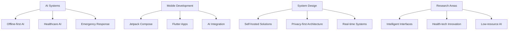

# 👋 Hello, I'm Aditya Kumar

<div align="center">
  
[](https://git.io/typing-svg)

**🚀 Aspiring AI Engineer | Mobile Developer | System Designer | Open-Source Enthusiast**

[](https://github.com/adityakumar-dev)
[](https://github.com/adityakumar-dev)

</div>

---

## 🧑‍💻 About Me

I'm a **2nd year engineering student** passionate about building **intelligent, impactful, and accessible systems**. My focus lies at the intersection of **AI**, **mobile applications**, and **systems engineering**—especially in contexts like **healthcare**, **public safety**, and **local empowerment**. I thrive on building **offline-first**, **self-hosted**, and **privacy-respecting** solutions.

```typescript
const aditya = {
    status: "2nd Year Engineering Student",
    location: "India 🇮🇳",
    focus: ["AI Systems", "Mobile Development", "System Design"],
    passion: "Building intelligent, impactful, and accessible systems",
    specialties: ["Offline-first AI", "Healthcare Tech", "Emergency Response"],
    achievements: ["2x Hackathon Winner", "Government Platform Developer"],
    seeking: "Research & Internship opportunities in AI system design",
    funFact: "I code best when I'm slightly sleepy ☕"
};
```

- 🔭 Currently working on **offline-first AI systems** and **intelligent mobile solutions**
- 🌱 Exploring **AI system design**, **intelligent interfaces**, and **health-tech** innovation
- 👯 Looking to collaborate on **AI-powered applications** and **open-source projects**
- 🏆 **2x Hackathon Winner** (1x National Level, 1x College Level)
- 🏛️ Developed and deployed a full-stack **government-backed platform** for local e-commerce
- 💬 Ask me about **AI integration**, **offline systems**, **mobile development**, and **emergency response tech**
- 📫 Reach me at: **adityakumar.devxlinux@gmail.com**
- 🎯 Actively seeking **research and internship opportunities** in **AI system design** and **health-tech**

---

## 🛠️ Tech Stack & Tools

**Languages & Frameworks:**  


**AI & ML:**  


**Infrastructure & Tools:**  


<div align="center">

### 📱 Additional Mobile Technologies


### 🌐 Web Technologies


### ⚙️ Backend & Database


### 🔧 Additional Languages & Tools


</div>

**Specialties:**
- 🔋 Building **offline-first** and **low-resource** AI systems
- 🗣️ Integrating **TTS/STT**, **image understanding**, and **chat interfaces**
- 🏗️ Developing full-stack systems with **real-time updates** and **emergency response** features
- 🛡️ Creating **self-hosted** and **privacy-respecting** solutions
- 🏥 **Healthcare** and **public safety** system design

---

## 📊 GitHub Analytics

<div align="center">
  


</div>

<div align="center">
  
[](https://git.io/streak-stats)

</div>

<div align="center">
  
[](https://github.com/ryo-ma/github-profile-trophy)

</div>

---

## 🎯 Current Focus



---

## 🤝 Let's Connect

<div align="center">

[](https://twitter.com/adityakumar_dev)
[](https://linkedin.com/in/adityakumar-dev)
[](mailto:adityakumar.devxlinux@gmail.com)

</div>

---

## 💭 Quote of the Day

<div align="center">
  
*"The best way to predict the future is to implement it."* 

**Happy Coding! 🚀**

</div>

---

<div align="center">
  
### 🌟 Thanks for visiting my profile! 
*Don't forget to star ⭐ repositories you find interesting!*


</div>